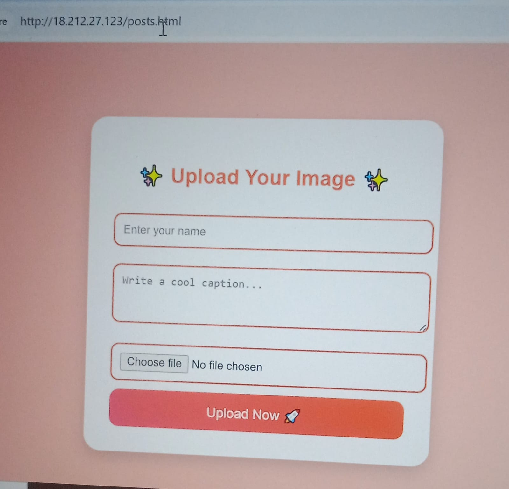
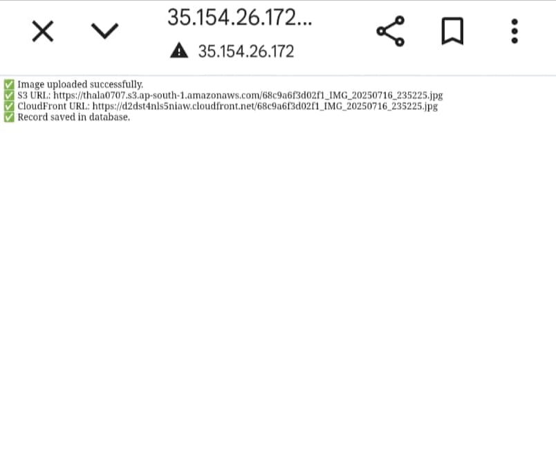

# AWS-Powered Serverless Media Uploader

This project presents a **serverless media upload platform** built with   **AWS Lambda, Amazon S3,** and **Amazon DynamoDB.** It allows users to seamlessly upload media files through a web-based interface. Uploaded files are stored in S3, while metadata is efficiently managed in DynamoDB.

## Key Features

## ⚙️ Serverless Architecture
* Powered by AWS Lambda for scalable, cost-efficient backend processing — no server management required.

## 📦 Scalable Object Storage
* Utilizes **Amazon S3** to securely store media files with high availability and durability.

## 📊 Metadata Management
* Leverages **Amazon DynamoDB** for fast and flexible storage of media metadata, enabling quick retrieval and queries.

## 💻 Simple Web Interface
* A clean and intuitive front-end interface allows users to upload media files with ease.
## Ideal Use Cases

* Media upload portals

* Content management systems (CMS)

* Photo or video sharing apps

* Event-based uploads (e.g., conferences, campaigns)

## Project Architecture Diagram

## Project Walkthrough and Components
Below is a step-by-step overview of the core components and workflow of the Serverless Media Upload Hub, complemented by screenshots to illustrate each stage:
## 1. Upload Interface

This image shows the web form used for uploading media, where users input a name, caption, and select a file.

## 2. IAM Role Permissions
.png)

Details of the IAM role permissions granted to the Lambda function, allowing it to interact with S3 and DynamoDB.

## 3. Lambda Function Code
.png)

A view of the Python code for the AWS Lambda function, which orchestrates the upload to S3 and data entry into DynamoDB.

## 4. S3 Bucket Overview
.png)

The Amazon S3 bucket (lamdawithdynadb) where the media files are stored.

## 5. DynamoDB Table Entries
.png)

The reels DynamoDB table displaying the metadata for uploaded items, including id, caption, file_url, and name.

## 6. Successful Upload Confirmation

The confirmation message displayed on the web interface after a successful media upload, showing the stored details and file URL.

## High-Level Deployment Steps

* To set up the Serverless Media Upload Hub, follow these key steps:

### 1.Create and Configure S3 Bucket
Set up an Amazon S3 bucket to securely store uploaded media files with appropriate access policies.

### 2.Set Up DynamoDB Table
Create a DynamoDB table to hold media metadata such as file details, upload timestamps, and user information.

### 3.Define IAM Role and Permissions
Create an IAM role granting your Lambda function the necessary permissions to interact with S3, DynamoDB, and other AWS services securely.

### 4.Develop and Deploy Lambda Function
Build the AWS Lambda function responsible for handling file uploads, processing metadata, and orchestrating the workflow. Deploy it using tools like AWS CLI, AWS SAM, or Serverless Framework.

### 5.(Optional) Create Lambda Layer
If your Lambda function requires external libraries or dependencies, package them into a Lambda Layer and attach it to your function for cleaner deployment.

### 6.Configure API Gateway
Set up Amazon API Gateway to expose your Lambda function through RESTful HTTP endpoints, enabling web clients to interact with the backend.

### 7.Build Frontend Interface
Develop a simple, user-friendly frontend (e.g., a React or plain HTML/JS app) that connects to the API Gateway, allowing users to upload media and submit metadata easily.

